# Eco Smart Tax Mod
A server mod for Eco 10.0 that extends the law and economy system with the following:
 - A smart tax legal action that defers collection to avoid transaction spam, and tracks debt if the citizen can't pay
 - A smart payment legal action that tracks credit if the government can't pay, and can be used to pay off tax debt
 - A smart rebate legal action that cancels out tax debt without being backed by currency
 - A tax card generated for each player showing their current outstanding debts, rebates and credits along with a personal financial report
 - A log attached to the tax card showing the last 100 tax and payment events, similar to a bank account's transaction log
 - A government tax card generated for each government bank account showing a by-day report of taxes, payments and rebates issued
 - Legal expressions to query the citizen's current tax debt and payment credit within a law
 - Legal expressions to query aggregate financial data such as how many taxes were paid within a given time period by a certain demographic

## Installation
1. Download `EcoSmartTaxMod.dll` from the [latest release](https://github.com/thomasfn/EcoSmartTaxMod/releases).
2. Copy the `EcoSmartTaxMod.dll` file to `Mods` folder of the dedicated server.
3. Restart the server.

## Usage

### Tax Card
Any player can access their tax card by running the chat command `/tax card`. This will open a window showing their current outstanding taxes, rebates and payments followed by a personal financial report containing daily breakdowns of their total taxes, rebates and payments issued.

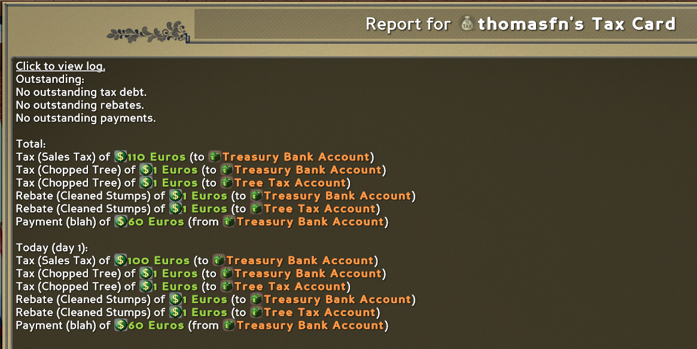

Clicking on the "Click to view log" link at the top will open the tax log. This shows the last 100 tax events in a UI very similar to the bank account transaction log.

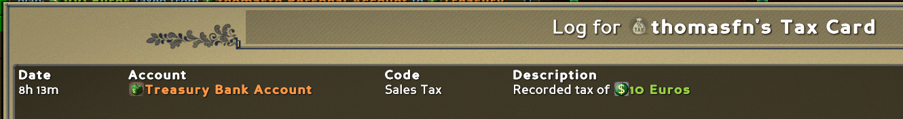

You can view the tax card of another player using the chat command `/tax othercard {player name}`.

### Government Tax Card
Any player can access a government tax card by running the chat command `/tax govcard {gov bank account name}`. This will open a window showing a financial report containing daily breakdowns of all taxes, rebates and payments issued to/from this account.

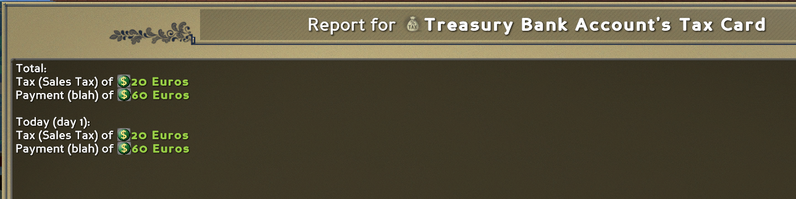

### Smart Tax
A tax can be issued to a player using the Smart Tax legal action from a law or executive action. This is used in a very similar manner to the vanilla Tax legal action. The Smart Tax can be found in the Finance section along with the other currency related legal actions. The important distinction is that the Smart Tax will not collect any currency right away, instead it will try to collect on the next tax tick, which by default runs every 5 minutes. This is to avoid spamming the bank account transaction logs. Successful tax collections will trigger the "Pay Tax" law trigger.

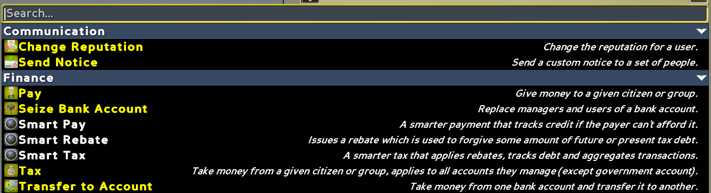

The Smart Tax legal action has the following properties:

| Property Name | Type | Description |
| - | - | - |
| Target Bank Acccount | Government Bank Account | Where the tax should be collected to. This also affects which rebates and payments are allowed to relieve this tax - only rebates and payments issued from this bank account may be used to do so. |
| Currency | Currency | The currency to collect. |
| Amount | Number | The amount to collect. This can be a fixed number or any regular Eco expression, e.g. a function of wealth or context. |
| Target | Citizen/Title/Demographic | Who to apply the tax to. If this refers to multiple citizens, e.g. via a title or demographic, each citizen will be taxed the full amount. |
| Tax Code | _String_ | An optional name for the tax. This helps distinguish it from other taxes on the tax card and in the tax log. By default, the name of the law or executive action will be used. |
| Suspended | Boolean | Whether the tax should be suspended. A suspended tax will not be collected until another non-suspended tax is issued to the citizen with the same target bank account and currency (but not necessarily the same tax code). Suspended taxes will still show on the tax card and may still be relieved by rebates or payments. |
| Silent | Boolean | Whether any notifications for the tax should be suppressed. Defaults to "No". This is helpful to set when applying a tax on a high frequency event, for example, the pollute air or the block placement law trigger. Silent taxes will still show on the tax card, in the tax log and will still make a notification when they're actually collected. |
| Infobox On Success | Boolean | This is built into all Eco's legal actions. For this particular one, it is not very useful, as Silent does the same thing. |

For example, consider the following Sales Tax law:

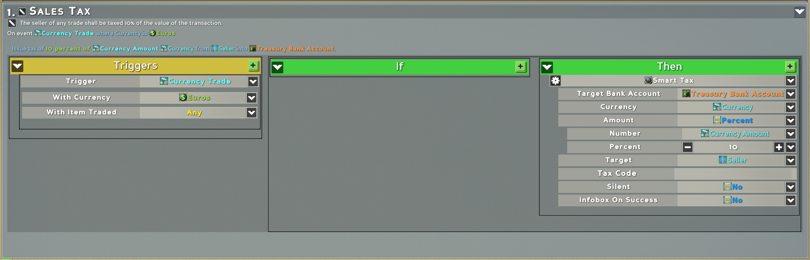

After a sale to the value of 100 Euros and following the next tax tick, the seller's tax log might look as follows:

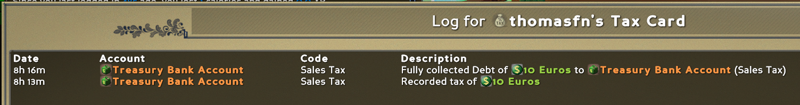

The benefits of doing a Sales Tax this way as opposed to using a Treasury are as follows:
- If the citizen is offered a rebate through another government scheme, for example a reward for cutting tree stumps, that rebate can be used to cancel out some of the sales tax without actually having to pay the citizen
- If statements can be used to apply different Sales Tax in different situations, for example a tax break when selling to a government store, or different rates based on the district in which the citizen or store resides

### Smart Rebate
A rebate can be issued to a player using the Smart Rebate legal action from a law or executive action. The Smart Rebate can be found in the Finance section along with the other currency related legal actions. A rebate is similar to a payment except it won't actually result in a monetary transfer to the citizen - it will only be used cancel out tax debt. Rebates are tracked, so if the citizen doesn't have any tax debt yet, it will remain stored on their tax card until they receive a tax. Rebates are resolved on the tax tick, right before collection.

The Smart Rebate legal action has the following properties:

| Property Name | Type | Description |
| - | - | - |
| Target Bank Acccount | Government Bank Account | Where the rebate should be offered from. This _only_ affects which taxes can be relieved via this rebate. For example, a rebate to the 'Environmental Funds' account can't be used to relieve a tax going to the 'Treasury Bank Account'. |
| Currency | Currency | The currency of the tax to relieve. |
| Amount | Number | The amount of tax debt to relieve. This can be a fixed number or any regular Eco expression. |
| Target | Citizen/Title/Demographic | Who to apply the rebate to. If this refers to multiple citizens, e.g. via a title or demographic, each citizen will be given a rebate of the full amount. |
| Rebate Code | _String_ | An optional name for the rebate. This helps distinguish it from other rebates on the tax card and in the tax log. By default, the name of the law or executive action will be used. |
| Silent | Boolean | Whether any notifications for the rebate should be suppressed. Defaults to "No". This is helpful to set when applying a tax on a high frequency event, for example, the pollute air or the block placement law trigger. Silent rebates will still show on the tax card and in the tax log. |
| Infobox On Success | Boolean | This is built into all Eco's legal actions. For this particular one, it is not very useful, as Silent does the same thing. |

For example, consider the following tree stump cleaning law:

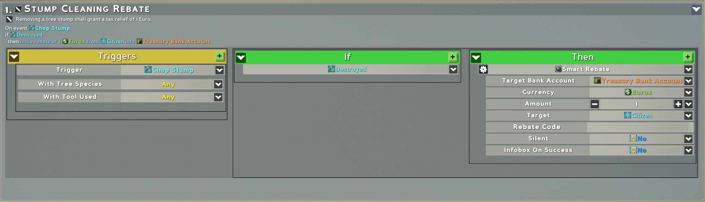

After chopping a few tree stumps, the citizen's tax log might look as follows:

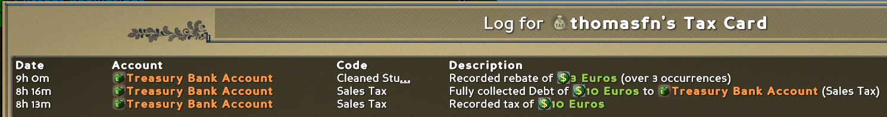

Note that since three rebates with the same target account, currency and code were issued in a row with no other tax events in between, they were combined into a single row.

After another sales tax of 10 Euros from the example law shown earlier, the tax card might look like this:

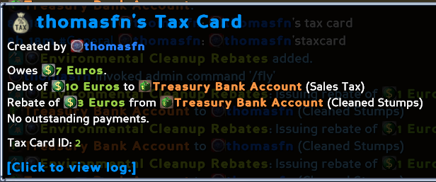

Following collection, the citizen's tax log might look as follows:

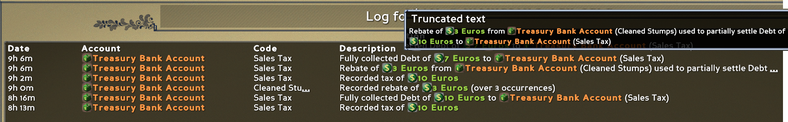

As you can see, the events in the tax log are clearly describing the calculations of how the tax rebates and debts are combined and collected.

### Smart Payment
A payment can be issued to a player using the Smart Payment legal action from a law or executive action. This is used in a very similar manner to the vanilla Pay legal action. The Smart Pay can be found in the Finance section along with the other currency related legal actions. As with the Smart Tax, the important distinction is that the Smart Pay will not pay any currency right away, instead attempting to pay on the next tax tick, to avoid spamming the bank account transaction logs. Payments are also used like rebates to relieve any tax debt before actually transferring currency. Successful payments will trigger the "Received Government Funds" law trigger.

The Smart Payment legal action has the following properties:

| Property Name | Type | Description |
| - | - | - |
| Source Bank Acccount | Government Bank Account | Where the payment should be made from. This also affects which taxes this payment is allowed to relieve - only taxes to this account may be relieved by this payment. |
| Currency | Currency | The currency to pay in. |
| Amount | Number | The amount to pay. This can be a fixed number or any regular Eco expression. |
| Target | Citizen/Title/Demographic | Who to pay. If this refers to multiple citizens, e.g. via a title or demographic, each citizen will be paid the full amount. |
| Payment Code | _String_ | An optional name for the payment. This helps distinguish it from other payments on the tax card and in the tax log. By default, the name of the law or executive action will be used. |
| Silent | Boolean | Whether any notifications for the payment should be suppressed. Defaults to "No". This is helpful to set when applying a tax on a high frequency event, for example, the pollute air or the block placement law trigger. Silent payments will still show on the tax card and in the tax log. |
| Infobox On Success | Boolean | This is built into all Eco's legal actions. For this particular one, it is not very useful, as Silent does the same thing. |

For example, consider the following road development payment law:

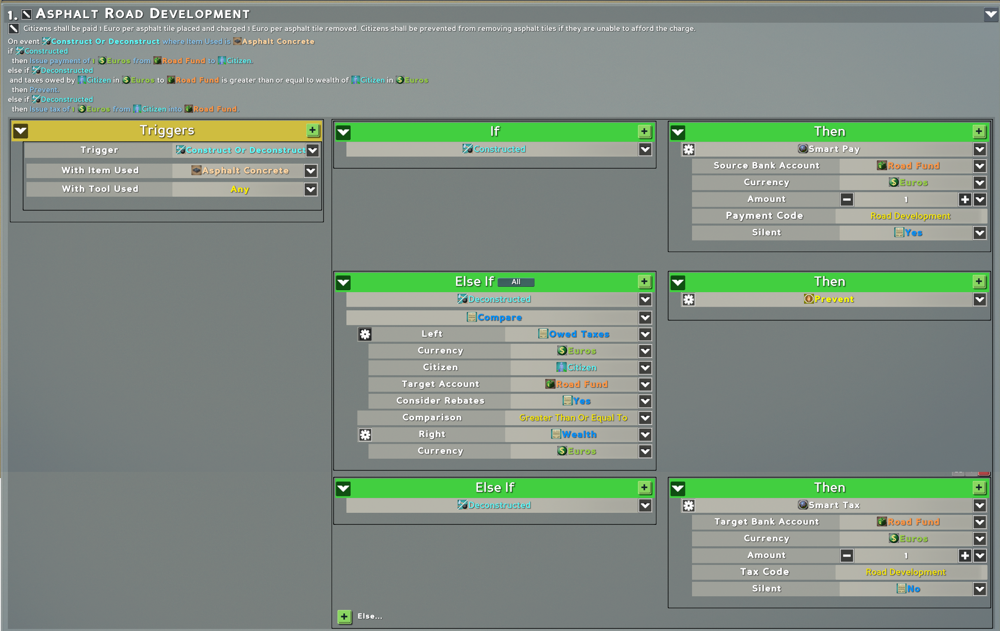

This law pays 1 Euro for every asphalt concrete block placed and charges 1 Euro for every block removed. It also prevents removing blocks if the citizen owes more money than their wealth. The advantages of using Smart Pay and Smart Tax here are as follows:
- No transaction or notification spam. At most one transaction will be generated every tax tick, so the transaction logs of both the citizen and the Road Fund account remain usable.
- The citizen is able to keep placing blocks even if the Road Fund account runs dry. In this case the amount they are owed is tracked and can be easily viewed on their tax card. They will be backpaid when the Road Fund account is topped up. This holds true even if the payouts in the law are changed or the law is removed entirely.
- If the citizen needs to pull up a large section of road and is given permission by a government official to do so, the government could grant the citizen a rebate that covers the cost that would incur for the citizen. The rebate cannot be used for any purpose other than paying off the block removal charge.

### Smart Transfer
A transfer between two citizens can be facilitated using the Smart Transfer legal action from a law or executive action. The Smart Transfer can be found in the Finance section along with the other currency related legal actions. As with the other smart actions, Smart Transfer will not pay any currency right away, instead attempting to pay on the next tax tick. It will also track debt if the target is unable to pay right away. Smart Transfers show up like taxes in the tax card and logs, but are paid to the recipient's personal account rather than a government account.

The Smart Transfer legal action has the following properties:

| Property Name | Type | Description |
| - | - | - |
| Recipient | Citizen/Title/Demographic | Who to pay. If this refers to multiple citizens, e.g. via a title or demographic, the amount to transfer is distributed evenly among them. |
| Currency | Currency | The currency to pay in. |
| Amount | Number | The amount to pay. This can be a fixed number or any regular Eco expression. |
| Target | Citizen/Title/Demographic | Who to withdraw money from. If this refers to multiple citizens, e.g. via a title or demographic, each citizen will pay the full amount. The amount will be withdrawn like a tax. |
| Transfer Code | _String_ | An optional name for the transfer. This helps distinguish it from other transfers on the tax card and in the tax log. By default, the name of the law or executive action will be used. |
| Silent | Boolean | Whether any notifications for the transfer should be suppressed. Defaults to "No". This is helpful to set when applying a tax on a high frequency event, for example, the pollute air or the block placement law trigger. Silent transfers will still show on the tax card and in the tax log. |
| Infobox On Success | Boolean | This is built into all Eco's legal actions. For this particular one, it is not very useful, as Silent does the same thing. |

### Owed Taxes
The amount of taxes currently owed by a player to a particular account can be queryed via the Owed Taxes game value. This returns their current tax debt. Since this could be between the point where the tax was issued and collection at the next tax tick, this could read positive even if they are currently able to pay the debt, so you should compare this value with their wealth if you want to determine if they're insolvent or not.

The Owed Taxes game value has the following properties:

| Property Name | Type | Description |
| - | - | - |
| Currency | Currency | The currency of the tax debt to query. |
| Citizen | Citizen | The citizen to query the tax debt of. |
| Target Acccount | Government Bank Account | The account to which the tax debt is owed. |
| Consider Rebates | Boolean | Whether any pending rebates and payments should be subtracted from the value. Defaults to "Yes". Note that this could cause this game value to return a negative number if they have a pending rebate larger than their tax debt. |

For example, consider the following simple custom chat command law:

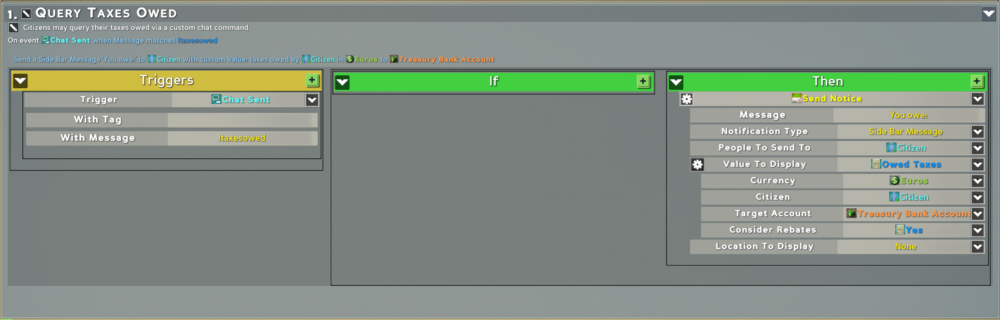

The example Road Development law above also makes use of this game value.

### Owed Payments
Similar to Owed Taxes, the amount of payments currently due to a player from a particular account can be queryed via the Owed Payments game value.

The Owed Payments game value has the following properties:

| Property Name | Type | Description |
| - | - | - |
| Currency | Currency | The currency of the owed payments to query. |
| Citizen | Citizen | The citizen to query the owed payments of. |
| Source Acccount | Government Bank Account | The account from which the payments are due. |

For example, consider the following simple custom chat command law:

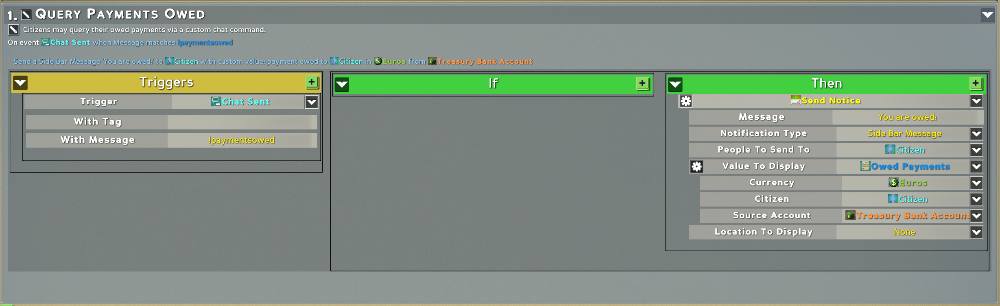

The example Road Development law above also makes use of this game value.

### Query Taxes Issued
The total amount of taxes issued via smart tax can be queried via the Query Taxes Issued game value. This has some flexibility about what is included in the total, including filtering by tax code, target bank account and time period.

The Query Taxes Issued game value has the following properties:

| Property Name | Type | Description |
| - | - | - |
| Currency | Currency | The currency of the issued taxes to query. |
| Target | Alias | The citizen, title or demographic to query the taxes issued to. For example this could be "Everyone" to get an aggregate of all taxes paid, or a single citizen e.g. a chat command based query. |
| _Filter Target Acccount_ | Government Bank Account | Can be none. If set, only taxes issued to this bank account are considered. |
| _Filter Tax Code_ | string | Can be blank. If set, only taxes issued with this tax code are considered. |
| Interval Start | number | See below for how the interval settings work. |
| Interval End | number | See below for how the interval settings work. |
| Interval Relative | boolean | See below for how the interval settings work. |

### Query Payments Issued
The total amount of taxes issued via smart tax can be queried via the Query Taxes Issued game value. This has some flexibility about what is included in the total, including filtering by tax code, target bank account and time period.

The Query Taxes Issued game value has the following properties:

| Property Name | Type | Description |
| - | - | - |
| Currency | Currency | The currency of the issued taxes to query. |
| Target | Alias | The citizen, title or demographic to query the taxes issued to. For example this could be "Everyone" to get an aggregate of all taxes paid, or a single citizen e.g. a chat command based query. |
| _Filter Target Acccount_ | Government Bank Account | Can be none. If set, only taxes issued to this bank account are considered. |
| _Filter Tax Code_ | string | Can be blank. If set, only taxes issued with this tax code are considered. |
| Interval Start | number | See below for how the interval settings work. |
| Interval End | number | See below for how the interval settings work. |
| Interval Relative | boolean | See below for how the interval settings work. |

### Intervals
Both Query Taxes Issued and Query Payments Issued game values support an interval via the Interval Start, Interval End and Interval Relative properties. These constrain the query to only consider taxes or payments within a certain time period. Since tracking of issued taxes/payments is per-day, the interval may only cover a period of whole days - it's impossible to query over a smaller time period than that.

The time period is described as a range between two days with a start and end day index, both inclusive. Day indices are zero based, e.g. 0 would be the first day.

The Interval Start and Interval End are day indices that are either _absolute_ or _relative_, depending on what Interval Relative resolves to when the law runs.
- Absolute day indices are relative to day 0 and positives track forwards - for example, Interval Start = 0 and Interval End = 1 would cover the 1st and 2nd days since server start.
- Relative day indices are relative to the current day and positives track backwards - for example, Interval Start = 0 and Interval End = 1 would cover "today" and "yesterday".
- To represent "all time", e.g. from day 0 to present, use Interval Relative = No, Interval Start = 0 and Interval End = World Time In Days

### For Admins
The tax card is stored in the game save along with all other objects such as bank accounts. A player's tax card can be wiped using the `/objects remove taxcards,{id}` command. A new blank one will then be created for the player when they next use `/tax card` or a tax/payment/rebate is issued to them.

## Building Mod from Source

### Windows

1. Login to the [Eco Website](https://play.eco/) and download the latest modkit
2. Extract the modkit and copy the dlls from `ReferenceAssemblies` to `eco-dlls` in the root directory (create the folder if it doesn't exist)
3. Open `EcoSmartTaxMod.sln` in Visual Studio 2019/2022
4. Build the `EcoSmartTaxMod` project in Visual Studio
5. Find the artifact in `EcoSmartTaxMod\bin\{Debug|Release}\net7.0`

### Linux

1. Run `ECO_BRANCH="release" MODKIT_VERSION="0.10.0.0-beta" fetch-eco-reference-assemblies.sh` (change the modkit branch and version as needed)
2. Enter the `EcoSmartTaxMod` directory and run:
`dotnet restore`
`dotnet build`
3. Find the artifact in `EcoSmartTaxMod/bin/{Debug|Release}/net7.0`

## License
[MIT](https://choosealicense.com/licenses/mit/)